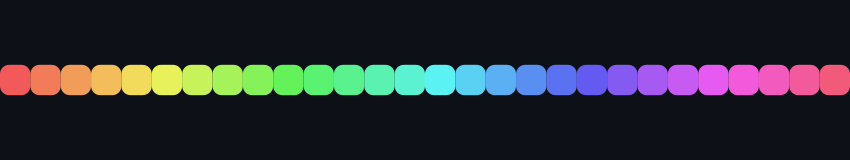

<!-- 🌌 ANIMATED SVG WAVE BANNER -->
<div align="center">
  
</div>

<br />

<!-- 🔮 NEON TYPING INTRO -->
<div align="center">
    <a href="https://git.io/typing-svg">
      
    </a>
</div>

<br />

<!-- 🔗 SLEEK SOCIAL LINKS -->
<div align="center">
  <a href="https://dpmods.com">
    
  </a>
  <a href="https://youtube.com/@dpmods">
    
  </a>
  <a href="https://github.com/DPModsYT">
    
  </a>
  
</div>

<br />

---

### 👋 About Me

```yaml
Name: DPMods
location: India
role: YouTuber · Website Developer · Android Modder
focus: Modified games & apps, custom web tools, reverse engineering
currently: Building small utility apps + growing DPMods on YouTube
fun_fact: I'd rather rebuild an APK from scratch than read its changelog
```

- 🎮 I create **modified games & apps**, showcased on my [YouTube channel](https://youtube.com/@dpmods)
- 🌐 I build and ship **custom websites & tools**, hosted via Firebase / Vercel
- 🔧 I enjoy **Android modding & reverse engineering** — pulling things apart to understand them
- 📬 Reach me through [dpmods.com](https://dpmods.com) or my socials below

<br />

---

### ⚡ Arsenal & Tech Stack
<div align="center">
  
  
  
  
  
  
  
  
  
</div>

<br />

---

### 🚀 Featured Projects

<div align="center">

<table>
<tr>
<td width="50%" valign="top">

**[YT_Downloader_By_DPMods](https://github.com/DPModsYT/YT_Downloader_By_DPMods)**
<br />
A Python-based YouTube downloader tool built for quick, no-fuss video grabs.


</td>
<td width="50%" valign="top">

**[BackgroundRemover](https://github.com/DPModsYT/BackgroundRemover)**
<br />
A lightweight HTML-based tool for removing image backgrounds in-browser.


</td>
</tr>
</table>

</div>

<br />

---

### 📊 GitHub Activity
<div align="center">
  
  
</div>

<div align="center">
  
</div>

<br />

---

<!-- 🌌 FOOTER WAVE -->
<div align="center">
  
  <br /><br />
  <sub>Thanks for stopping by — check out <a href="https://dpmods.com">dpmods.com</a> or catch new drops on <a href="https://youtube.com/@dpmods">YouTube</a> ⚡</sub>
</div>
